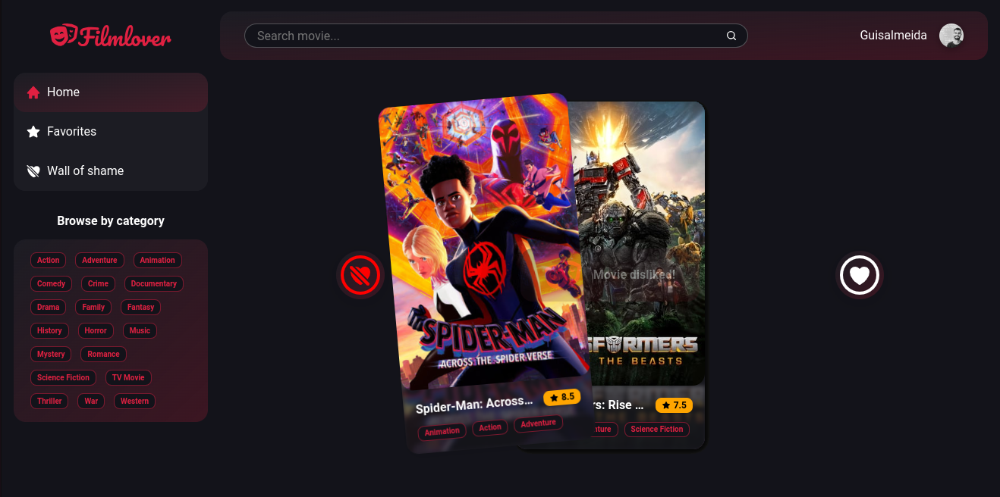
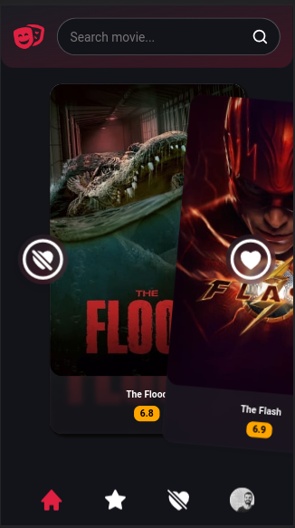

  

# FilmLover Web App  
Match with your favorite movies and shame the other ones.  

  

### Made with:

   

### Live in https://filmlover.netlify.app/  

  
  

### TODO:  

- [ ] Improve lazy loading (blurhash)
- [ ] Typescript
- [ ] Unit Tests